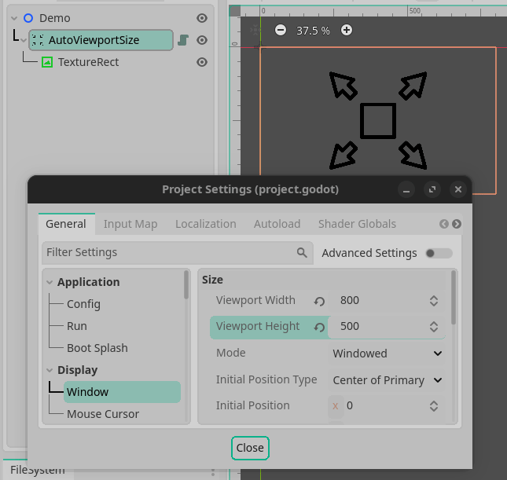
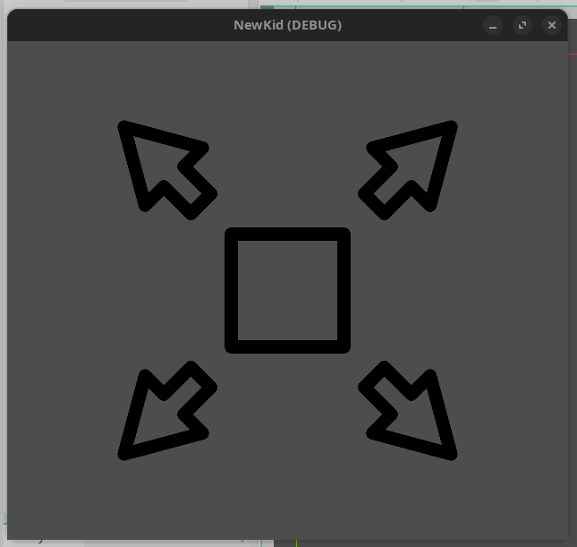

# UIKid

UIKid is a playful (and currently very, very, very... sparse) collection of tools designed to help you create awesome user interfaces in Godot Engine. It's currently in its early stages, so expect some rough edges. But hey, that's part of the fun, right? If you're looking for a serious, corporate-approved UI solution, this might not be for you. But if you're ready to play and experiment, welcome to the UIKid playground!

## What's Inside?

- **[AutoViewportSize](addons/ui_kid/auto_viewport_size/README.md) :** A simple container that automatically adapts its size to match your game window or the project settings in the Godot editor. Perfect for creating responsive UIs that fit any screen size. Simply replace your top-level MarginContainer(s) with AutoViewportSize and watch your UI scale effortlessly. 

<table style="border-collapse: collapse;">
    <tr>
    <td style="border: 1px solid #00000011;"></td>
    <td style="border: 1px solid #00000011;"></td>
    </tr>
</table>

## Encountering Problems?

It's quite likely that you will encounter issues when incorporating UIKid in your Godot Engine Project. This is because no one has ever used UIKid before and You don't get to be THE early-adopter without losing a couple of teeth, assuming you have any left. Sorry and thank-you. 

Please feel free to create a GitHub issue or submit a PR to the repo, It'll be fun for both of us!

## License

This Godot Engine Plugin is distributed under the terms of the MIT license, as described in the [LICENSE file](LICENSE) file.

